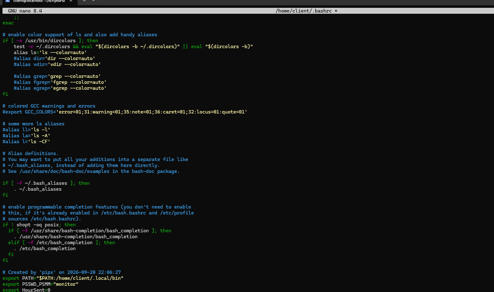

## Paramètrage des VMs 

Passer en mode bridge toutes les vms en allant dans les parametres réseaux de la VM.


## Installation de MariaDB 
Dépôt officiel de Maria DB 
````
curl -LsS https://r.mariadb.com/downloads/mariadb_repo_setup | bash
apt update
apt install mariadb-server mariadb-client -y
````

Checker la version
````
mariadb --version
apt policy mariadb-server
````

On paramètre pour lancer au démarrage mariadb
````
systemctl start mariadb
systemctl enable mariadb
````


Ensuite on créée la base PSSMLOG 
````
CREATE DATABASE PSSMLOG;
````

On crée plusieurs profils (hugo,matis,alex)
````
CREATE USER 'alex'@'localhost' IDENTIFIED BY 'alexpass';
````
on donne tous les droits à cet utilisateur

````
GRANT ALL PRIVILEGES ON *.* TO 'alex'@'localhost' WITH GRANT OPTION;
````

Pour tester les accès 
````
mariadb -u alex -p
````
On devrra renseigner notre mot de passe


Pour un utilisateur depuis la vm cliente  
````
CREATE USER 'client'@'ADRESSE_IP' IDENTIFIED BY 'mot_de_passe';
````
````
GRANT ALL PRIVILEGES ON *.* TO 'client'@'ADRESSE_IP' WITH GRANT OPTION;
````


## Installation Proftpd
````
/etc/proftpd/
├── proftpd.conf                    ← config de base (identité serveur, port, IP d'écoute)
└── conf.d/
    ├── starfleet-ftp.conf          ← chroot, restrictions d'accès
    └── starfleet-tls.conf          ← chiffrement SSL/TLS
````

````
apt update
apt install -y proftpd
apt install proftpd-mod-crypto
sudo service proftpd start
sudo service proftpd restart
````

#### Configuration de base 

On prépare le dossier qui va accueillir les données de notre serveur FTP 
>sudo mkdir /var/opt/psmmFTP


>nano /etc/proftpd/proftpd.conf 
````
# Spécification du nom d’hôte et du message de bienvenue
ServerName "Serveur FTP"
DisplayLogin "La connexion au serveur FTP sous Debian s’est effectuée avec succès !"
# Instructions générales de connexion
<Global>
    # Autoriser l’accès uniquement avec les interfaces systèmes, qui sont définies dans /etc/shells
    RequireValidShell on
    # Refuser la connexion root
    RootLogin off
    # Spécifie le répertoire FTP auquel l’utilisateur est autorisé à accéder
    DefaultRoot /var/opt/psmmFTP  # Remplacez par le répertoire souhaité
</Global>
# Définir les utilisateurs/groupes d’utilisateurs autorisés pour la connexion FTP
<Limit LOGIN>
    # L’enregistrement n’est possible que pour les utilisateurs du groupe de référence ftpuser
    # Au lieu d’une longue liste, le groupe autorisé est simplement nié (!)
    DenyGroup !ftpuser
</Limit>
````

On s'assure que nos utilisateurs ne peuvent accéder qu'au serveur FTP et pas à l'ensemble du système
````
sudo sh -c 'echo "/bin/false" >> /etc/shells'
````

On rajoute un nouveau groupe pour le FTP : ftpPSMM
On active pour notre utilisateur ftpuser avec mot de passe :monitor
````
sudo adduser ftpuser --shell /bin/false --home /home/ftpuser
````


## Installation Nginx

Vérifier que le fichier dans /etc/apt/sources.list est bien rempli avec les dépôts Trixie à jour.

Pour installer ce qui va permettre de télécharger le paquet nginx : 
````
apt install -y wget gnupg2 ca-certificates lsb-release
wget -qO - https://nginx.org/keys/nginx_signing.key | gpg --dearmor -o /usr/share/keyrings/nginx-archive-keyring.gpg
echo "deb [signed-by=/usr/share/keyrings/nginx-archive-keyring.gpg] http://nginx.org/packages/debian $(lsb_release -cs) nginx" > /etc/apt/sources.list.d/nginx.list
````


Installation de nginx

````
sudo apt update
sudo apt install nginx-agent
````


Lancement de Nginx
```bash 
systemctl start nginx
```


On prépare le dossier pour le service web 
````
sudo mkdir /var/www/monserveurweb
````

On ajoute un fichier index.html dans le dossier pour le service web 
````
sudo chown -R www-data:www-data /var/www/monserveurweb
````
````
sudo chmod 755 www-data:www-data /var/www/monserveurweb
````

````
sudo nano /var/www/monserveurweb/index.html
````

````
<html>
<head></head>
<body>
<h1>Bienvenue sur mon serveur Web !</h1>
</body>
</html>
````
 
 


On configure notre siteweb 

>nano /etc/nginx/sites-available/monserveurweb

````
server {

    listen 80;
    listen [::]:80;

    root /var/www/monserveurweb/;

    index index.html;
    
    #On précise que n'importe qu'elle requête sur ce serveur , renvoie à cette page html
    server_name _;

    location / {
        try_files $uri $uri/ =404;
    }
}
````

````
ln -s ln -s /etc/nginx/sites-available/serveurweb /etc/nginx/sites-enabled/serveurweb 
````

````
sudo nginx -t
sudo systemctl restart nginx
````

on rajoute l'authentifcation basique pour notre serveur web  

Installation d'apache 2 pour ses outils
````
sudo apt install apache2-utils
````
On ajoute notre utilsateur monitor.
On rajoute le -c pour créer le fichier, si on veut mettre d'autres utilisateurs, on omet le -c. On devra mettre un mot de passe hachuré dans le fichier 
En se connectant en tant que root :
````
htpasswd -c /etc/nginx/.htpasswd monitor
````

on ajoute les directive pour l'authentification pour tout le site.

````
server {

    listen 80;
    listen [::]:80;

    root /var/www/monserveurweb/;

    index index.html;
    
    #On précise que n'importe qu'elle requête sur ce serveur , renvoie à cette page html
    server_name _;

    location / {
        try_files $uri $uri/ =404;
    }

    auth_basic           "Monitor domain";
    auth_basic_user_file /etc/nginx/.htpasswd;

}
````


Sécurisation de l'accès aux serveurs sans mot de passe
````
ssh-keygen -t rsa -b 4096 -C "alex.taylor@laplateforme.io"
ssh-copy-id monitor@monServeur
````


Une fois la commande passé, laisser les parametres de sauvegarde du fichier par défaut.
puis faire 
Bien garder où setrouve notre clé.

````
ssh monitor@monServeur
````

On va maintenant installer python et  la bibliothèque Fabric sur notre vm cliente 
````
sudo apt install python3 -y
sudo apt install python3-pip -y
````

````
sudo apt install python3-paramiko -y
````

## JOB 02

### Installation pour l'envoi de mail par serveur 

Suivre le tuto du prof (à revoir pour mettre en forme)
mot de passe appli : udts ujcp anto udnz


````
sudo apt install msmtp msmtp-mta
```` 


### JOB 03
````
import paramiko
import sys


# argv[0] nom du script pour mettre l'adresse ip du serveur que l'on choisit
host = sys.argv[1]
username = "monitor"
key_filename="/home/client/.ssh/id_rsa"

try:
        client = paramiko.client.SSHClient()
        client.set_missing_host_key_policy(paramiko.AutoAddPolicy())
        client.connect(host, username=username, key_filename=key_filename)
        _stdin, _stdout,_stderr = client.exec_command("df")
        print(_stdout.read().decode())
        client.close()
except paramiko.AuthenticationException as error:
    print("ERROR")

````

id_rsa → clé privée — à garder secrète, jamais partagée, permissions restrictives (chmod 600)
id_rsa.pub → clé publique — celle qu'on copie sur le serveur distant (dans ~/.ssh/authorized_keys)
known_hosts → empreintes des serveurs distants déjà connus/vérifiés

### JOB 04

on ajoute le mot de passe dans une variable de notre environnement debian de manière persistante 

`````
echo 'export PSSWD_PSMM="monitor"' >> ~/.bashrc
source ~/.bashrc
`````

````
import paramiko
import sys
import os

# argv[0] nom du script
host = sys.argv[1]
username = "monitor"
key_filename="/home/client/.ssh/id_rsa"
client = paramiko.client.SSHClient()
client.set_missing_host_key_policy(paramiko.AutoAddPolicy())
client.connect(host, username=username, key_filename=key_filename)
#pour rentrer le mot de passe en interactif
_stdin, _stdout,_stderr = client.exec_command("sudo df", get_pty=True)
#utilisation de la variable PSSWD_PSMM d'environnement avec le mot de passe sudo pour les vm 
_stdin.write(os.environ["PSSWD_PSMM"]+'\n') 
_stdin.flush()
print(_stdout.read().decode())
client.close()

````

### JOB 05

On décommente et regarde où mettre les logs de mariadb dans un fichier séparé 
````
sudo nano /etc/mysql/mariadb.conf.d/50-server.cnf
````
````
log_error = /var/log/mysql/error.log
````
Nous devons remplacer bind-address = 127.0.0.1 par bind-address = 0.0.0.0 pour autoriser la connexion depuis un autre pc


On créé le dossier géré par mysql

````
sudo mkdir /var/log/mysql
sudo chown mysql:mysql /var/log/mysql
````

on relance 
````
sudo systemctl restart mariadb
````

Sur la VM cliente, on installe la bibliothèque PyMySQL :
````
python3 -m pip install PyMySQL --break-system-packages
````

### JOB 06

On va utiliser la table DUAL virtuelle pour permettre de faire des tests sur des données extérieures à notre base de donnée.


### Job 07


### job 08 


### job 09


### job 10

revoir shlex

cron tab

### job 11 
Il existe aussi une commande plus simple à exploiter, déjà installée sur Debian :
```
 vmstat 1 2
 ````
Elle affiche deux lignes de mesures. La première est une moyenne depuis le démarrage, à ignorer. La seconde porte sur la dernière seconde écoulée. Dans cette deuxième ligne, la colonne id donne directement le pourcentage d'inactivité, et tu appliques le même calcul : 100 − id. La sortie de vmstat est un simple tableau de nombres, plus facile à découper avec split() que celle de top.


Pour occuper le processeur comme on veut
````
 while true; do timeout 0.75 yes > /dev/null; sleep 0.25; done &
 ````

 Pour la mémoire (et aussi le cpu)
 ````
 stress-ng --vm 1 --vm-bytes 600M --vm-keep --timeout 120s
 ````
 


### job 12

Ajout CRONTAB

### job 13

 On exporte d'abord une variable d'environnement HourSent pour savoir l'heure actuelle , si il y a un différentielle de plus d'heure 1 entre notre heure actuelle et la variable HourSent alors on affecte cette nouvelle heure à HourSent et on envoit un mail. 

 

# AJOUTER DANS  TACHE CRONTAB

# job 14